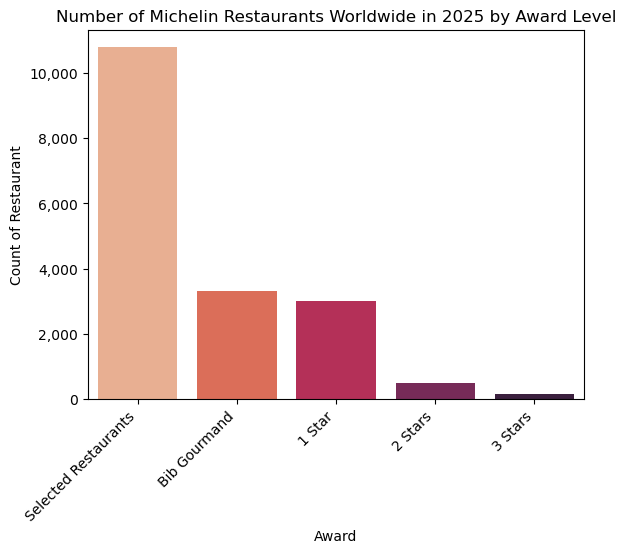
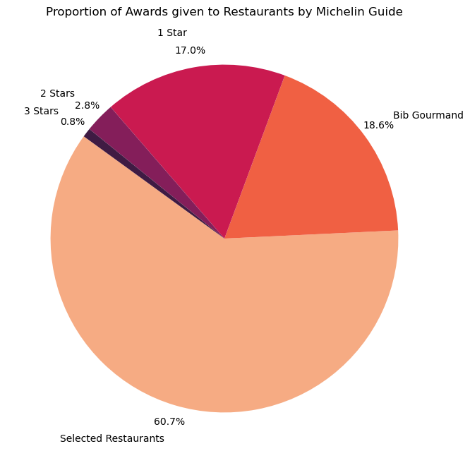
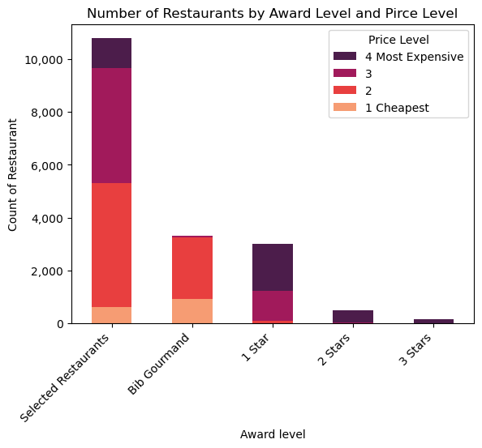
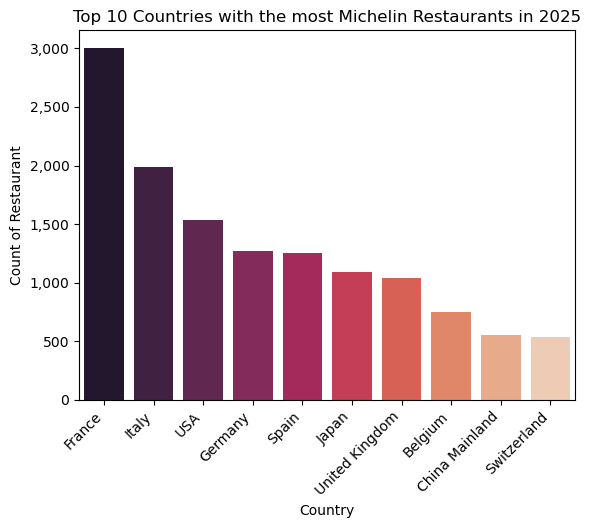
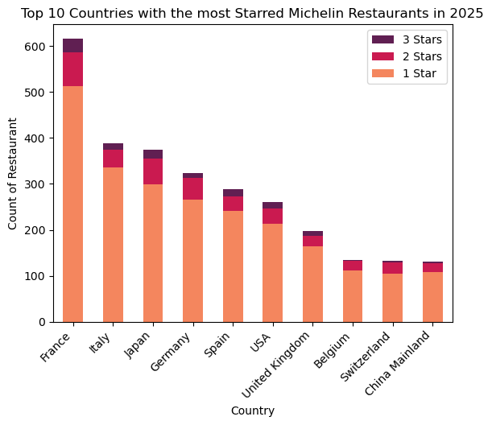
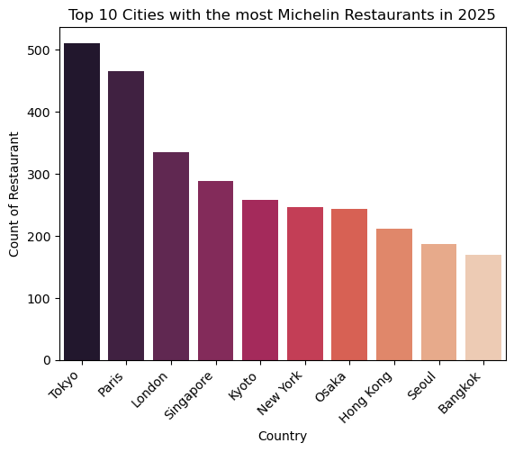
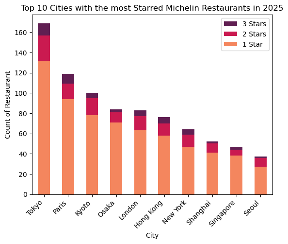
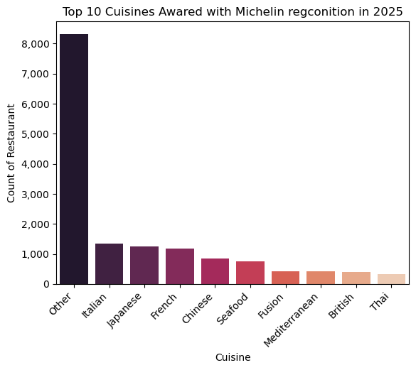
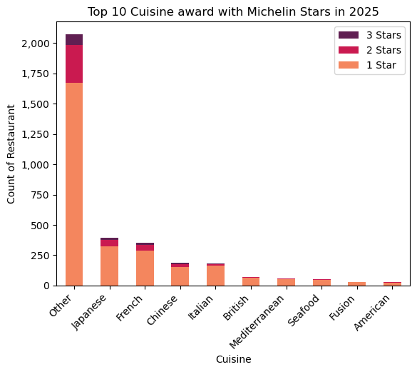

# Analysis of Michelin Restaurants in 2025 using Python

Welcome to my analysis of the Michelin Restaurants in 2025. This porject was created to find out which country and city have the most number of Michelin Restaurant. It looks into the number of Michelin restaurants around the world and which cuisine has the most number of Michelin recognition. 

The data soured from [Kaggle](https://www.kaggle.com/datasets/ngshiheng/michelin-guide-restaurants-2021) provides the database for my analysis, containing detailed information on the restaurant names, locations, Michelin award level, etc.. Through a series of Python scropts, I explored key questions such as the countries and cities with the most Michelin restaurants and Starred restaurants. 

# The Questions
Below are the questions I want to answer in my project:
1. What is the proportion of awards for each award level in the Michelin Guide? 
2. Which country has the most number of Michelin restaurants?
3. Which city has the most number of Michelin restaurants?
4. Which cuisine is most likely to get a Michelin recognition?

# Tools I used
For my analysis, I use several key tools:
- **Python**: This is the programming language I used to perform the data analyses. Within Python, I also used the libraries below for their respective fuctions:
    - **Pandas** for data analysis
    - **Matplotlib** for data visualisation
    - **Seaborn** for advanced customisation on visuals
- **Jupyter Notebook**: I use this to run my Python scripts which let me easily include my notes and analysis. 
- **Visual Studio Code**: For executing my Python scripts.
- **Git & GitHub**: Essential for version control and sharing my Python code analysis. 
- **ChatGPT**: For trouble shooting when codes run into error and transform manually writted dataset into code that is repetitive.

# Data Preparation and Cleanup
This sections outlines the steps taken to prepare the data for analysis, exusring accuracy and usability. 

## Import Data
``` 
# Importing Libraries
import pandas as pd
import matplotlib.pyplot as plt 
import seaborn as sns

#Load datase to df
df = pd.read_csv('michelin_my_maps.csv')
```

## Data Cleanup

### Splity ```Location``` into ```City``` and ```Country``` 
```
#Split city and country into its own columns
df[['City', 'Country']] = df['Location'].str.split(', ', n=1, expand = True)

#Find out what cities have null country
null_country = df[df['Country'].isnull()].index.tolist()
df.loc[null_country, 'City'].unique().tolist()

# ['Singapore', 'Hong Kong', 'Macau', 'Dubai', 'Abu Dhabi', 'Luxembourg']

#Since these are either city states or small countries, The country is filled with the city name. 
#Fill null Country with City 
df['Country'] = df['Country'].fillna(df['City'])
```
### Unify all prices using price level
```df['Price_level'] = df['Price'].str.len().astype(int)```

### Use the primary cuisine as the sole cuisine in ```Cuisine```
```
df['Cuisine'] = df['Cuisine'].str.split(',')

def replace_multiple_cuisines(cuisine):
    cuisines = cuisine.split(", ")  # Assuming cuisines are separated by commas
    if len(cuisines) > 1:
        return cuisines[0]  # Return the first cuisine
    return cuisine  # Return the original if only one cuisine

# Apply the function to the 'Cuisine' column
df_cuisine_grouped = df.copy()
df_cuisine_grouped['Cuisine'] = df_cuisine_grouped['Cuisine'].apply(replace_multiple_cuisines)
```

### Categorise ```Cuisine``` into ```Summarised Cuisine``` for more generalised analysis
```
#This code was created by ChatGPT
category_mapping = {
    'Afghan': ['Afghan'],
    'African': ['African', 'Ethiopian', 'North African'],
    'American': ['American', 'American Contemporary', 'Californian', 'Creole', 'Southern', 'Tex-Mex'],
    ...
    'Vegan & Vegetarian': ['Vegan', 'Vegetarian'],
    'Venezuelan': ['Venezuelan'],
    'Vietnamese': ['Vietnamese', 'Vietnamese Contemporary']
}

# Create a reversed mapping from original cuisine to summarised cuisine
reverse_category_mapping = {orig: summarised for summarised, originals in category_mapping.items() for orig in originals}

# Function to categorize cuisines
def categorise_cuisine(cuisine):
    return reverse_category_mapping.get(cuisine, "Other")

df_cuisine_grouped['Summarised Cuisine'] = df_cuisine_grouped['Cuisine'].apply(categorise_cuisine)
```

# The Analysis

## 1. What is the proportion of awards for each award level in the Michelin Guide? 

To find the proportion of award for each award level in the Michelin Guide, I categorised the number of award in each award level and plot both a bar chart and a pie chart. 

```
# Bar Chart
award = df.groupby('Award').size().sort_values(ascending=False).reset_index(name = 'Count')

sns.barplot(data= award, x = 'Award', y = 'Count', hue = 'Award', palette = 'rocket')
```

### Results
The bar chart shows the numebr of Michelin Restaurants in each award level in 2025. It's no surprise that Selected Restaurant which is the lowest award level has the most number of restaurant whereas 3 Stars which is the highest award level (and most difficult to attain) has the least number of restaurants. 



*1.1 Bar Chart on the Number of Michelin Award for each Award Level in 2025*

```
#Pie Chart
award_prop = df.groupby('Award').size().reset_index(name = 'award_count')

colours = sns.set_palette('rocket_r', n_colors=len(awards))
fig, ax = plt.subplots(figsize=(8, 8))
ax.pie(award_counts, labels=awards, colors=colours, startangle=144,autopct='%1.1f%%', labeldistance=1.2, pctdistance=1.1)
```

The pie chart shows the proportion of Michelin Restaurants in each award level in 2025. Similar to the bar chart above, the number of restaurant in each award level decreases as the award level gets higher. Interestingly, the proportion of restaurants awarded Bib gourmand and 1 star is relatively similar. It's worth investigating the difference in assessment criteria for these two award levels. 



*1.2 Pie Chart on the Number of Michelin Award for each Award Level in 2025*

A further analysis finds out that most Bib Gourmand restaurants are cheaper than 1 Star restaurants. 



*1.3 Stack Bar Chart on the price level distribution of restaurants in each award level*

### Insights:
- Selected Restaurants are the easiest award level to attain, with 60.7% of restaurants within the Michelin Guide being awarded this award level. 
- The number of restaurants awarded Bib Gourmand and 1 Star are very similar yet their price levels are very different. It's worth investigating what are the assessment criteria between the two award levels. More importantly, It's probably worth going to Bib Gourmand restaurants over 1 Star restaurants because of the generally lower price range yet similar thresholds on assessment. 

## 2. Which country has the most number of Michelin restaurants?

To find out which county has the most number of Michelin restaurants, I split ```Location``` column in the original database into ```City``` and ```Country``` and did some data cleaning to replace null values in ```Country``` with appropriate values. For instance 'Singapore' does not have a 'Country' in the ```Country``` column, I extracted those lines using ```.loc[]``` to replace both ```City``` and ```Country``` as 'Singapore. 

### Results
The results below show the Country with the most number of Michelin restaurants in the world. 



*2.1 Bar Chart showing the top 10 countries with the most number of Michelin Restaurants in the world in 2025.*

More importantly, I want to find out the country with the most number of Michelin Starred Restaurants in the world. It's clear that France has the most number of Micheline Starred Restaurants in the world. However comparing the two graphs, USA has the third most Michelin restaurants in the world whereas Japan is placed sixth on the group above. On the contrary, when only accounting Starred restaurants (graph below), Japan has the third most number of starred restaurants in the world whereas the USA is placed sixth on the graph.



*2.2 Stacked Bar Chart showing the top 10 countries with the most number of Michelin Starred Restaurants in the world in 2025.*

### Insights
- France has the most number of Michelin restaurants and starred restaurants in the world. 
- Japan has more starred restaurants than USA whereas when accounting all award level, USA has more Michelin restaurants in all together. 
- Out of the top 10 countries with Michelin restaurants, seven of them are located in Europe. If you are happened to be living in Europe or travelling around Europe, it's not a bad region to visit some restaurants with Michelin recognitions. 

## 3. Which city has the most number of Michelin restaurants?
Using the ```City``` column explored in the last question, I found which city in the world has the most number of restaurants awarded with Michelin recognitions. 

### Results
The graph below shows the city with the most number of Michelin restaurants in the world. 



*3.1 Bar Chart showing the top 10 cities with the most number of Michelin Restaurants in the world in 2025.*

Similarly, I created a graph showing the top 10 cities with the most number of Starred restauants in the world. 



*3.2 Stacked Bar Chart showing the top 10 countries with the most number of Michelin Starred Restaurants in the world in 2025.*

### Insights
- With reference to cities, Tokyo has the most number of Michelin restaurants in the world. There are so many Michelin Starred restaurants in Tokyo that the number of 1 Star restaurants in Tokyo is greater than the number of all starred restaurants combined in Paris (second place in the graph). 
- On both graphs depitcing the number of Michelin restaurants in cities around the world, there are 7 Asian cities (Tokyo, singapore, Kyoto, Osaka, Hong Kong, Seoul and Bangkok in graph 3.1 and Tokyo, Kyoto Osaka, Hong kong, Shanghai, Singapore and Seoul in graph 3.2) in both graphs and 3 of the top 10 cities are located in Japan. This means that if you are touring Japan, it will be easy to find a Michelin restaruant. 
- Since I go back to Hong Kong occassionally, flights from Hong Kong to all the other Asian cities in both graphs are relatively cheap. When I go home, I should take advantage of the close proximity to the other Asian cities to visit as many Michelin restaurants as possible while in Asia. 

## 4. Which cuisine is most likely to get a Michelin recognition?

Having gone through the geography distribution of Michelin restaurants, I wonder if there are more likelihood to be award a Michelin recognition from certain cuisine. After reviewing the data, There are all together 261 cuisines recorded in the ```Cuisine``` column. I mannually did a summary of the 261 cuisines and try to group all the cuisines into 72 "Summary cuisines". I asked ChatGPT to create a ```dictionary``` for me using the summary cuisines as ```keys``` and the original cuisines as ```values```. 

### Results
The graph below shows the top 10 cuisines with the most Michelin Awards. 



*4.1 Bar Chart showing the top 10 cuisines with the most number of Michelin restaurants*

The graph below shows the top 10 cuisines with the most Michelin Starred restaurants.



*4.2 Bar Chart showing the top 10 cuisines with the most number of Michelin stared restaurants*

